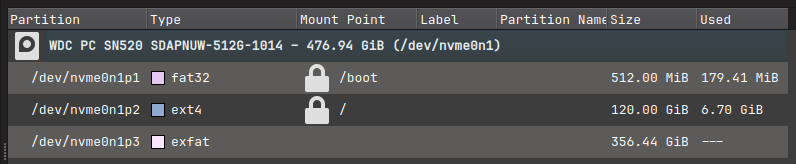
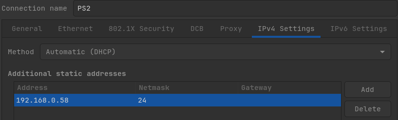

<!-- Install Instructions -->
## PS2-UDPBD Arch Linux Setup

This is my little guide for setting up my PS2 with a UDPBD server on Arch Linux.

> **Note:** the `setup.sh` script uses **paru** as the package manager, i recommend installing paru before proceeding with this guide.

1. Clone the repository:

    ```sh
    git clone https://github.com/seethastars/ps2-udpbd.git
    ```

2. Change to the repository directory:

    ```sh
    cd ps2-udpbd/
    ```
    
3. Run the install script:

    ```sh
    ./setup.sh
    ```
4. Open up paritionmanager and create a new exFAT partition, in my case i have an NVME SSD so it most likely will be: `/dev/nvme0n1p3.`


5. Create a new mount point and mount the new partition onto it:

    ```
    sudo mkdir /mnt/ps2
    ```
    ```
    sudo mount /dev/nvme0n1p3 /mnt/ps2 -o uid=$USER
    ```
6. Create folders named `CD` and `DVD` in `/$HOME/games/ps2/` and rip/copy the PS2 disc images into the folder that corresponds with their original source media. 

- Example: `$HOME/games/ps2/DVD/Grand Thef Auto III.iso`.

8. Download the [latest udpbd release](https://github.com/sync-on-luma/xebplus-neutrino-loader-plugin/releases/) and extract the `UDPBD-for-XEB+ Sync App` folder.

9. For a direct connection (PC to PS2), set a manual IPv4 address and subnet mask:


10. Go to the PS2 and open LaunchELF from the browser or open it holding *R1* during FreeMCBoot/PS2BBL startup screen.
Then select MISC/ --> PS2Net and let the PS2 idle.

11. Into `xeb_neutrino/UDPBD Sync App` folder run the following command:

```
dotnet UDPBD-for-XEB+-CLI.dll -path /mnt/ps2/ -ps2ip 192.168.0.10 -bin2iso
```

12. Unmount the exFAT partition then go into `udpbd-server` directory and start the udpbd-server.
```
sudo umount /mnt/ps2
sudo ./udpbd-server.x86_64 /dev/nvme0n1p3
```

The server needs to be open for the entire play session, launch XEB+ and play!

## Credits

Special thanks to:

[@sync-on-luma](https://github.com/sync-on-luma/xebplus-neutrino-loader-plugin) for making the XEB+ Neutrino Launcher.

[@MegaBitmap](https://github.com/MegaBitmap/UDPBD-for-XEBP) for the UDPBD-XEB server.
